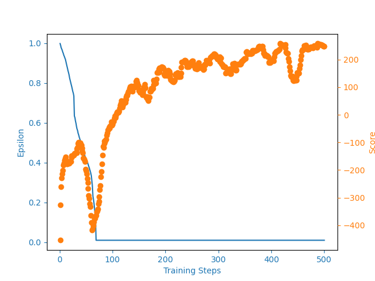

# Lunar Lander

Reinforcement Learning to play the Lunar Lander game.

Following [this video](https://www.youtube.com/watch?v=SMZfgeHFFcA).

Using Python 3.7.9, tensorflow 2.4.1, atari-py 0.2.6

Scores and epsilon over time:

